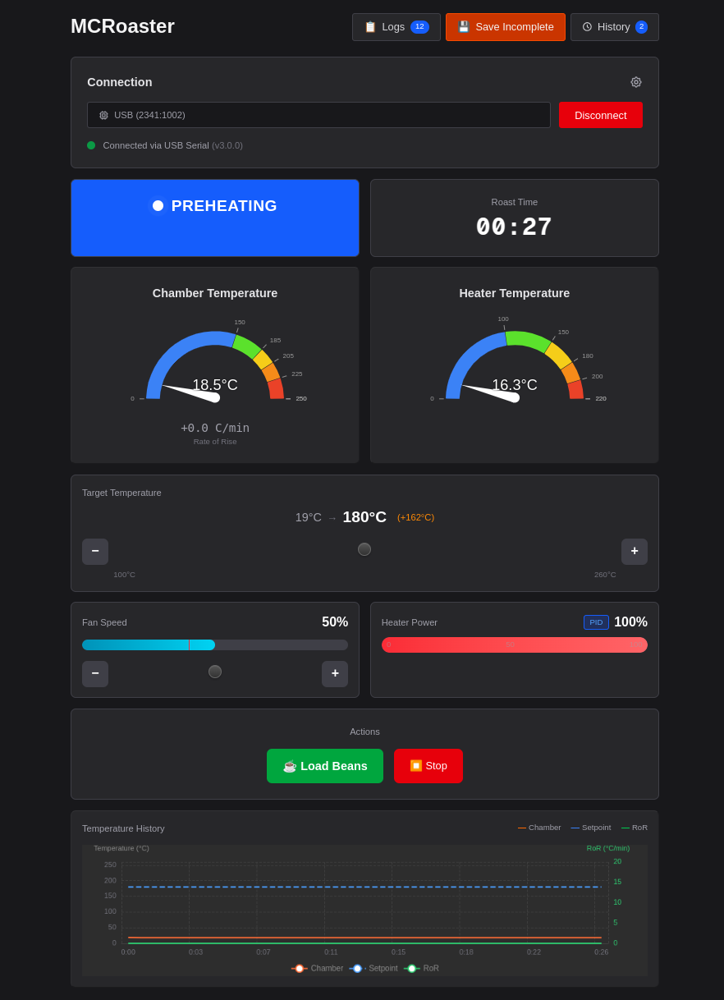
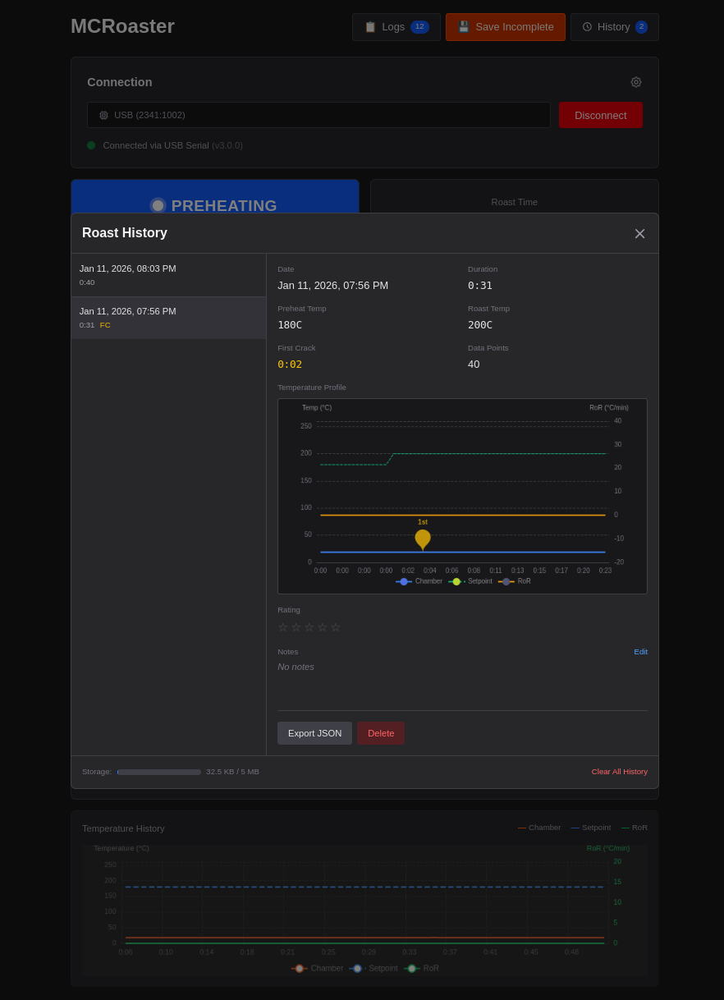

# MCRoaster 🔥☕

A DIY fluid bed coffee roaster controller with real-time web interface. Built with an Arduino Uno R4 WiFi and a modern React frontend, MCRoaster gives you precise control over every aspect of your [...] 



## ✨ Features

### Real-Time Temperature Monitoring
- **Dual temperature display** with chamber and heater temps
- **Live temperature graph** with 60-second scrolling window
- **Rate of Rise (RoR)** calculation for tracking roast development
- **First Crack marker** to log that critical moment

### Intelligent State Machine
MCRoaster guides you through the entire roasting process:

| State | Description |
|-------|-------------|
| **OFF** | System idle, all outputs disabled |
| **FAN_ONLY** | Fan running without heater (pre-warm beans, testing) |
| **PREHEAT** | Heating chamber to target temperature before loading beans |
| **ROASTING** | Active roasting with PID temperature control |
| **COOLING** | Post-roast cooling cycle at maximum fan speed |
| **MANUAL** | Direct control mode for advanced users |

### PID Temperature Control
- **Dual-mode PID tuning** - Aggressive when far from setpoint, conservative when close
- **Configurable setpoints** for preheat and roasting temperatures
- **Time-proportioning heater control** for smooth, consistent heat delivery

### Safety First
- **Over-temperature protection** with automatic shutdown at 260°C
- **Thermistor-based heater monitoring** for redundant safety
- **Minimum fan speed enforcement** when heater is enabled
- **Thermocouple fault detection** (open circuit, short to GND/VCC)
- **Auto-cooling on disconnect** if the browser loses connection

### Roast History & Logging
- **Save complete roast profiles** including temperature curves
- **Rate and annotate** your roasts with notes
- **Export roasts as JSON** for analysis or sharing
- **Real-time system logs** for debugging



### Modern Web Interface
- **WebSerial API** - No drivers or additional software needed
- **Works directly in Chrome/Edge** (desktop only)
- **Responsive design** with dark theme
- **One-click connection** to your roaster

---

## 🛠️ Hardware Requirements

### Bill of Materials (BOM)

| Component | Specific Model | Notes |
|-----------|---------------|-------|
| **Microcontroller** | Arduino Uno R4 WiFi | Uses WebSerial over USB (WiFi not used) |
| **Thermocouple Amplifier** | MAX31855 breakout board | K-type thermocouple interface |
| **K-Type Thermocouple** | - | High-temp probe for roast chamber |
| **Motor Driver** | L298N H-Bridge | Controls blower fan speed |
| **Blower Fan** | 12V centrifugal blower | Sized for your roast chamber |
| **Solid State Relay (SSR)** | 25A DC-AC SSR | For heating element control |
| **Heating Element** | - | Sized for your roast chamber (typically 300-1500W) |
| **Thermistor** | 100kΩ NTC (β=3950) | Safety monitoring on heater |
| **Fixed Resistor** | 100kΩ | For thermistor voltage divider |
| **12V Power Supply** | - | For blower fan and L298N logic |
| **5V Power Supply** | - | Optional, Arduino can power sensors |
| **Roast Chamber** | - | DIY or modified popcorn popper |

### Pin Connections

| Function | Arduino Pin |
|----------|-------------|
| Thermocouple CS | Pin 10 |
| Thermocouple MISO | Pin 12 (Hardware SPI) |
| Thermocouple SCK | Pin 13 (Hardware SPI) |
| Thermistor | A1 |
| Fan ENA (PWM) | Pin 9 |
| Fan IN1 | Pin 8 |
| Fan IN2 | Pin 7 |
| Heater SSR | Pin 6 |

---

## 💻 Software Setup

### Prerequisites

- [PlatformIO](https://platformio.org/) (VS Code extension recommended)
- [Node.js](https://nodejs.org/) 18+ 
- Chrome or Edge browser (WebSerial support required)

### Firmware Upload

1. Clone the repository:
    ```bash
    git clone https://github.com/michael-swartz/mcroaster.git
    cd mcroaster
    ```

2. Open in VS Code with PlatformIO extension

3. Build and upload to Arduino:
    ```bash
    pio run -t upload
    ```

### Web Interface

1. Install dependencies:
    ```bash
    cd interface
    npm install
    ```

2. Run development server:
    ```bash
    npm run dev
    ```

3. Open http://localhost:3000 in Chrome/Edge

4. Click **"Select Port"** to connect to your Arduino

---

## 🎮 Usage

### Basic Roast Workflow

1. **Connect** - Click "Select Port" and choose your Arduino
2. **Set Preheat Temperature** - Adjust to your desired preheat temp (default: 180°C)
3. **Start Preheat** - Chamber begins heating
4. **Load Beans** - Once preheated, add your green beans and click "Load Beans"
5. **Monitor & Adjust** - Watch temps, adjust setpoint as needed
6. **Mark First Crack** - Click when you hear it!
7. **End Roast** - Click to begin cooling cycle
8. **Cool Down** - Wait for beans to cool below 50°C

### Manual Mode

For advanced users who want direct control:
- Adjust fan speed 0-100%
- Adjust heater power 0-100%
- No PID - you're in full control

### Roast History

Access your saved roasts anytime:
- View temperature profiles with interactive graphs
- Add notes about bean origin, roast level, taste notes
- Rate your roasts 1-5 stars
- Export as JSON for external analysis

---

## ⚙️ Configuration

Key parameters can be adjusted in `src/config.h`:

```cpp
// Temperature Targets
#define DEFAULT_PREHEAT_TEMP    180.0   // °C
#define DEFAULT_ROAST_SETPOINT  200.0   // °C
#define COOLING_TARGET_TEMP     50.0    // °C

// Safety Limits  
#define MAX_CHAMBER_TEMP        260.0   // °C - absolute max
#define MIN_FAN_WHEN_HEATING    40      // % - minimum fan with heater on

// PID Tuning
#define PID_KP_AGGRESSIVE       120.0
#define PID_KI_AGGRESSIVE       30.0
#define PID_KD_AGGRESSIVE       60.0
#define PID_KP_CONSERVATIVE     70.0
#define PID_KI_CONSERVATIVE     15.0
#define PID_KD_CONSERVATIVE     10.0
```

---

## 🔒 Safety Features

MCRoaster takes safety seriously:

- **Chamber over-temp protection** - Auto-shutdown if temp exceeds 260°C
- **Heater element monitoring** - Secondary thermistor monitors heater directly  
- **Minimum airflow enforcement** - Fan must be ≥40% when heater is on
- **Thermocouple fault detection** - Detects open/short circuits
- **Disconnect protection** - Auto-enters cooling mode if browser disconnects for >5 seconds
- **State machine guards** - Prevents dangerous state transitions

⚠️ **WARNING**: This is a DIY project involving high temperatures and electricity. Build and operate at your own risk. Never leave the roaster unattended while operating.

---

## 📁 Project Structure

```
mcroaster/
├── src/                    # Arduino firmware
│   ├── main.cpp           # Main loop and setup
│   ├── state.cpp/h        # State machine implementation
│   ├── hardware.cpp/h     # Hardware abstraction (fan, heater, sensors)
│   ├── safety.cpp/h       # Safety monitoring system
│   ├── pid_control.cpp/h  # PID controller
│   ├── serial_comm.cpp/h  # JSON serial communication
│   └── config.h           # Pin definitions and constants
├── interface/             # Next.js web interface
│   └── src/
│       ├── app/           # Next.js app router
│       ├── components/    # React components
│       ├── hooks/         # Custom hooks (useWebSerial, useRoastHistory)
│       └── types/         # TypeScript definitions
├── docs/                  # Architecture and design docs
└── platformio.ini         # PlatformIO configuration
```

---

## 🙏 Acknowledgments

- Architecture inspired by [esoren/roast](https://github.com/esoren/roast)

---

**Happy Roasting!** ☕🔥